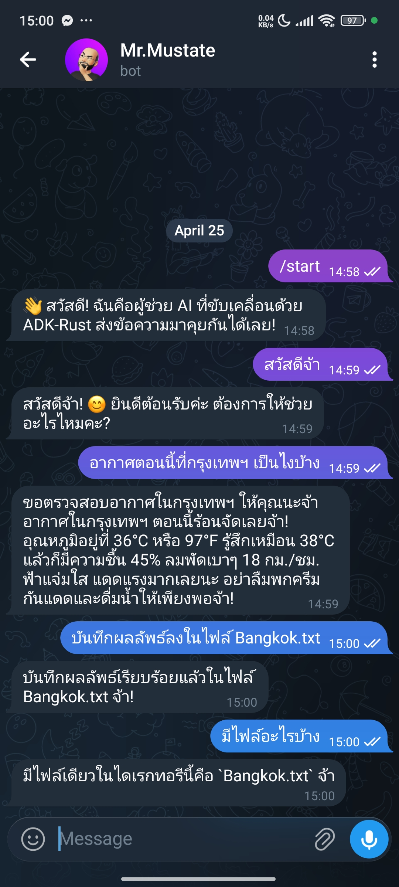

# ThaiLLM SDK & Tooling

A comprehensive suite of SDKs and tools for interacting with Thai Large Language Models (LLMs). This project provides multi-language support and proxy utilities to simplify the integration of Thai LLM services into various applications.

## 📂 Project Structure

This repository is organized into several modules, each catering to different development needs:

| Module | Description | Key Features |
|:---|:---|:---|
| [**Dart SDK**](./dart) | A high-level client for Dart and Flutter. | Simple API, Multi-turn chat, Error handling, support for Typhoon, OpenThaiGPT, Pathumma, etc. |
| [**Rust Agent**](./rust) | An agentic framework built with `adk-rust`. | Custom `ThaiLLM` model trait, Tool support (Weather, Filesystem), CLI & API server modes. |
| [**Rust OpenAI**](./rust_openai) | Rust agent using OpenAI-compatible client. | Uses built-in `adk-rust` OpenAI client for compatible ThaiLLM endpoints. |
| [**LiteLLM Proxy**](./litellm_proxy) | OpenAI-compatible proxy layer using LiteLLM. | Standardizes various Thai LLM providers into a single OpenAI-compatible endpoint. |
| [**Python Proxy**](./python_proxy) | Specialized LiteLLM configuration and scripts. | Custom proxy logic for Typhoon and other Thai LLM services. |
| [**Telegram Bot**](./telegrame_bot) | AI-powered Telegram bot with tool use. | Multi-user sessions, Weather & Filesystem tools, built with `adk-rust` and `teloxide`. |

## 🖼️ ThaiLLM Telegram Bot Screenshots

<p align="center">
  
</p>

## 🚀 Quick Start

### 🎯 Dart & Flutter SDK

Ideal for building mobile and web applications with native Thai LLM support.

```bash
cd dart
dart pub get
```

*See [Dart README](./dart/README.md) for usage examples.*

### 🦀 Rust Agentic Framework

Ideal for building autonomous agents with tool-use capabilities using a custom model implementation.

```bash
cd rust
# Configure THAILLM_API_KEY in .env
cargo run
```

*See [Rust README](./rust/README.md) for more details.*

### 🦀 Rust OpenAI Agent

Ideal for quickly connecting to OpenAI-compatible ThaiLLM endpoints using standard clients.

```bash
cd rust_openai
# Configure THAILLM_API_KEY in .env
cargo run
```

### 🐍 Python & LiteLLM Proxy

Provides an OpenAI-compatible API for ThaiLLM models, enabling use with existing OpenAI-based tools.

```bash
cd python_proxy
pip install -r requirements.txt
python typhoon_proxy.py
```

*See [LiteLLM Proxy README](./litellm_proxy/README.md) and [Python Proxy README](./python_proxy/README.md) for configuration.*

## 🛠️ Supported Models & Providers

The SDKs are designed to work seamlessly with various Thai LLM providers, including:

* **Typhoon** (by SCB 10X)
* **OpenThaiGPT**
* **Pathumma** (by NECTEC)
* **KBTG**

## 📄 License

This project is licensed under the MIT License - see the [LICENSE](LICENSE) file for details.
